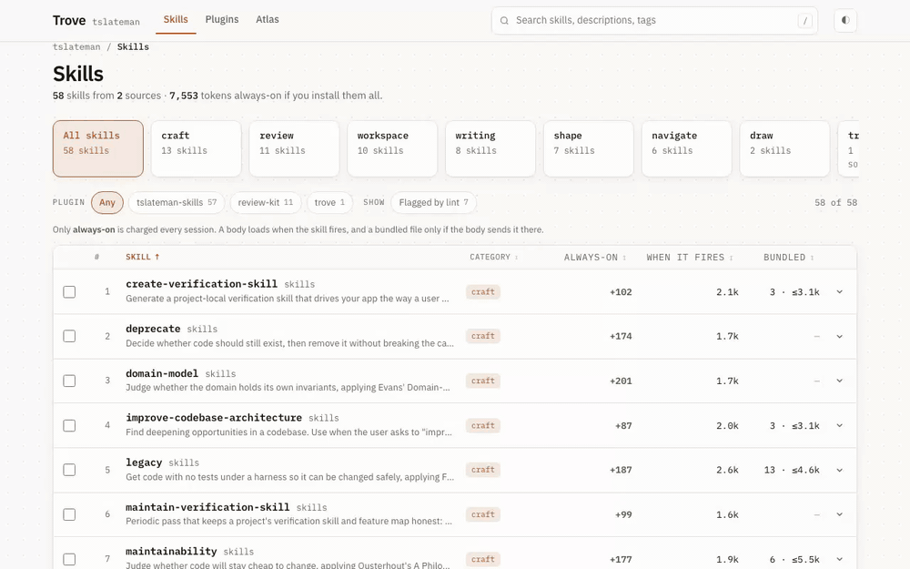
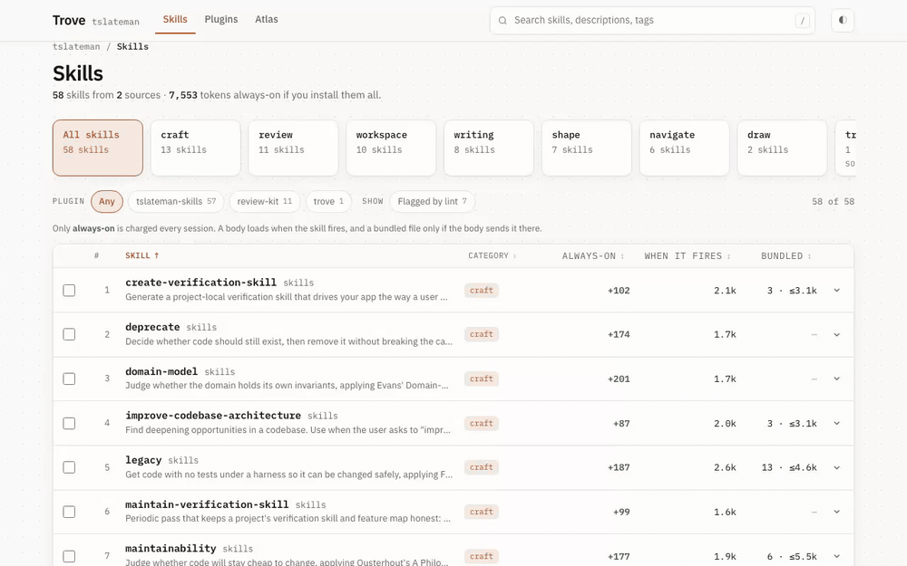
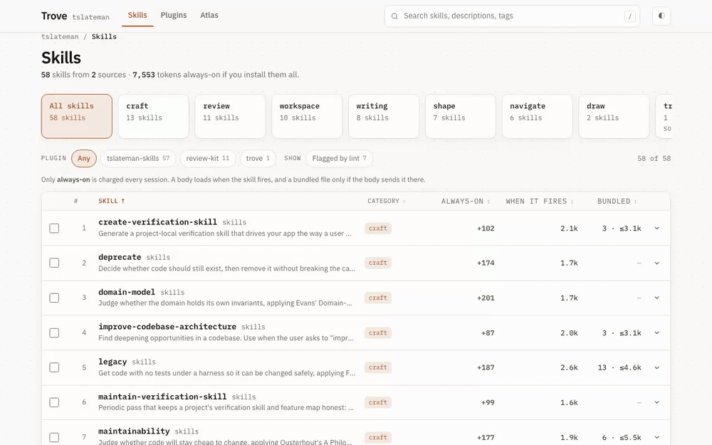
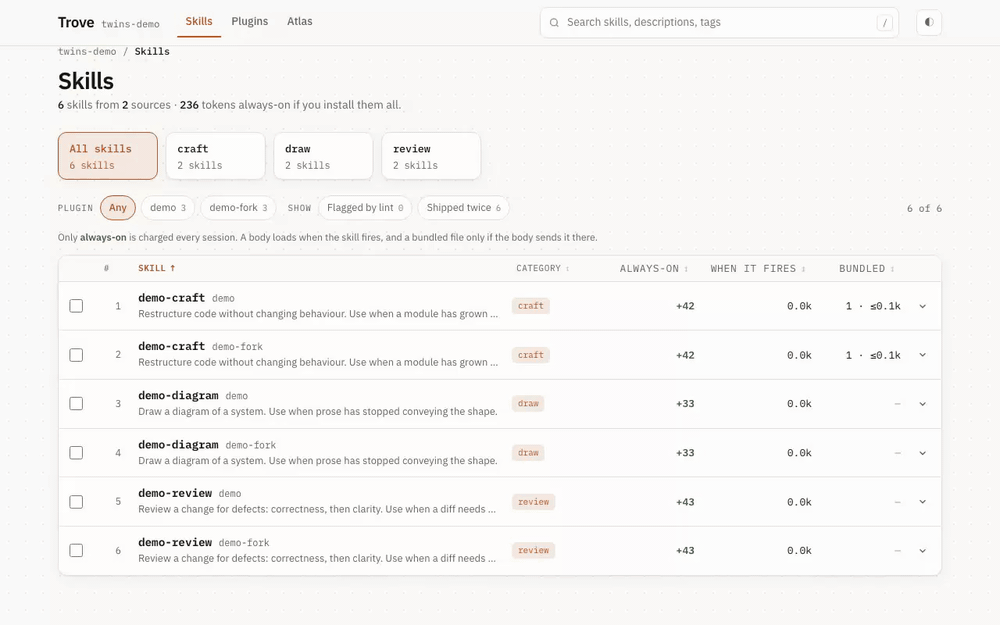
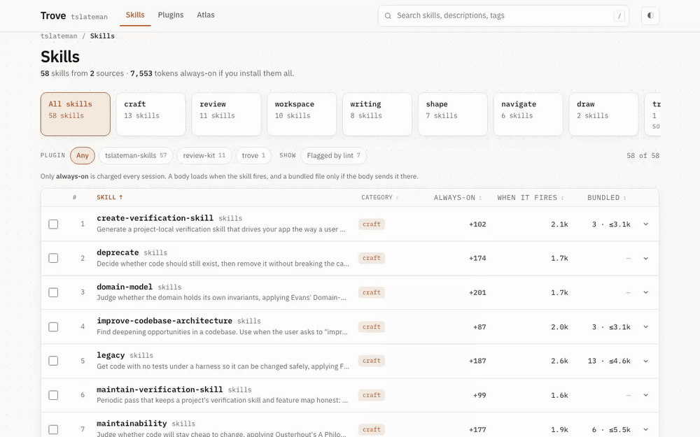
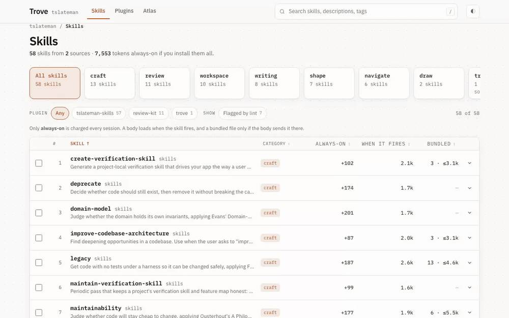
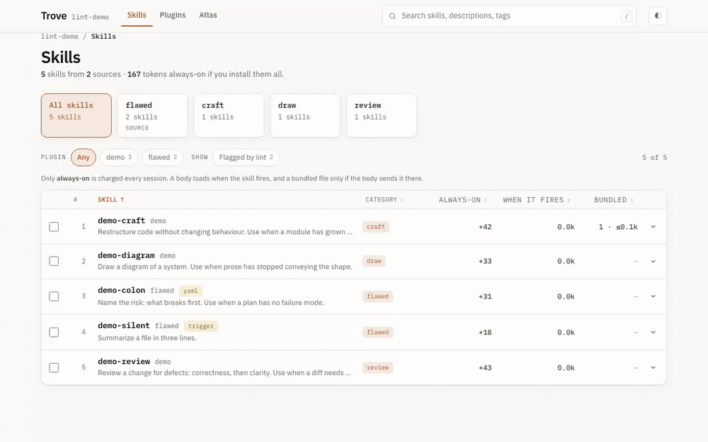

# Trove

A registry for Claude Code skills. Author skills in whatever repo owns them,
compose them into bundles, publish a marketplace, and browse the catalog with
token cost on every row.



New here? Start with the [getting started guide](docs/getting-started.md).
For every command and flag, see the [CLI reference](docs/cli.md).
When something fails, [troubleshooting](docs/troubleshooting.md).
Wrote a skill for yourself that the team should have?
[Share a skill](docs/sharing-a-skill.md).

## Why

Claude Code already distributes plugins well: `marketplace.json` carries
categories, tags, version and sha pinning, a `renames` map for deprecation, and
a `skills[]` field that cherry-picks individual skill directories out of a repo.

Trove generates the marketplace instead of hand-editing it, and prices every
skill so a bundle can be held to a budget.

## Install

```bash
just setup
```

`just verify` and `just shots` additionally need a Chromium build:

```bash
uv run --with playwright playwright install chromium
```

`just fmt` shells out to `prettier`, which is not managed by this project.

## Recipes

```bash
just scan          # index skills, report token cost per source
just build         # bundle.yaml -> marketplace.json, sha-pinned
just catalog       # catalog.json + the static site
just serve         # browse at http://127.0.0.1:8787
just dist          # build and catalog together, ready to publish

just cache         # what the fetched-source cache holds
just cache-clear   # empty it

just lint          # skills discovery cannot use
just drift         # bundle fields that disagree with their source plugin.json
just sync-local-check  # preview local-marketplace updates
just sync-local        # apply them
just orphans       # skills no plugin ships
just promote name source   # copy a personal skill into a source checkout and lint it
just twins         # skill names more than one source ships
just installed     # which of the bundle's plugins this machine has
just calibrate skills skills@local   # check estimates against Claude Code
```

`just --list` shows the rest. Every recipe takes its bundle from the `bundle`
variable, so `just --set bundle bundles/team.yaml catalog` targets another one.

Two bundles ship with the repo. `example.yaml` is a commented starter to copy,
and `demo.yaml` points at a fixture repo under `tests/fixtures` so CI and
`just verify` have a hermetic target.

Your own registry lives in `bundles/local.yaml`, which every recipe reads by
default and `.gitignore` keeps out of the repo:

```bash
cp bundles/example.yaml bundles/local.yaml
```

## The bundle

One file describes sources and the plugins composed from them.

```yaml
name: mine
sources:
  skills:
    repo: your-org/skills
    ref: v0.5.0 # optional; resolved to a commit sha at build time
    local: ~/dev/skills # optional, enables scanning before a remote exists

plugins:
  # description, version, homepage and displayName are inherited from the
  # source's .claude-plugin/plugin.json when the bundle omits them.
  - name: skills
    source: skills
    category: development
    tags: [review, craft]

  - name: review-kit
    source: skills
    description: Language review skills only # a curated subset earns its own
    tags: [review, linting]
    skills: # cherry-pick — no fork needed
      - skills/review/python-review
      - skills/review/go-review
      - skills/draw/ # a trailing slash takes the whole subtree

renames:
  duet: skills # deprecate without breaking installs

marketplace: mine # optional; only when a machine files this registry under another name
```



`local` points at the plugin root — the directory a `skills:` path is relative
to. A relative `local` resolves against the bundle file, not the working
directory. It is optional: a source with only a remote is fetched at build time,
so it indexes and catalogs like any other. Declare `local` to iterate on a
checkout you are editing, not to make a source visible.

A plugin inherits `description`, `version`, `homepage`, and `displayName` from
its source's `plugin.json`, so the repo that owns a plugin owns its metadata and
a version bump reaches the registry by itself. Declare a field in the bundle
only to override it deliberately — a curated subset needs its own description.
`trove drift` reports any restated field that disagrees with its source, and
`just check` runs it. Inheritance reads the fetched checkout, so a source needs
no local clone to supply its own metadata.

`ref` accepts a tag or a branch. Build resolves it to a commit sha, preferring
an annotated tag's target over the tag object, and refuses to guess when a tag
and a branch share the name.

`trove build` resolves each source to a commit sha via `git ls-remote` and emits
a `marketplace.json` a teammate consumes in two commands:

```bash
claude plugin marketplace add <your-registry>
claude plugin install review-kit@mine
```

## The stack tray

Picking skills fills the tray at the bottom of the page with a plugin block,
and copying it is the first of three steps the tray spells out: paste the block
under `plugins:` in your bundle, run `just dist`, then install the plugin the
build now carries. The tray hands over that command line too, so the path from
a picked row to a working install is copy, paste, copy, run.

The header carries the other direction. **Add a skill** names the repos this
registry reads and prints the commands that put a personal skill into one of
them, which is [the sharing guide](docs/sharing-a-skill.md) in short form.

## Mixing sources

`sources` is a map, so a bundle names as many repos as it wants and the
catalog browses all of them together. Picking skills from different sources
into one stack still works: the generated snippet groups by source and emits
a plugin block per source, each scoped to only the skills you picked from it.



## What this machine has installed

The catalog is what a registry offers. What a machine has is a different
question, and Claude Code already answers it: `claude plugin list --json`
reports every installed plugin, the version it holds, and whether it is
enabled.

`trove serve` asks that question on every request and answers `/installed.json`
from it. The Skills tab then carries an Installed filter and a badge per row,
each Plugins row shows its state on this machine and the command that fits it
(install, enable, or update), and the header prices what this machine loads
today beside what installing everything would cost. `just installed` prints the
same reading in the terminal, one row per plugin, offered version beside
installed version.

```bash
just installed
just --set marketplace other-name installed   # when the names differ
```

The reading joins on `<plugin>@<marketplace>`, which is the id Claude Code
files an install under. A bundle whose name is not the name teammates added the
marketplace under records the difference:

```yaml
name: my-registry
marketplace: the-name-claude-code-knows
```

A published build has no endpoint to ask, so it carries no install state and
says how to get some instead. The same panel opens whenever the reading comes
back empty, and it names the specific reason: a page with no server behind it,
no `claude` on PATH, a registry nobody has added yet, or a marketplace name
that does not match. In that last case the panel names the marketplace your
machine does file these plugins under, and offers the line that records it.

Install state never reaches `out/`, so publishing the catalog publishes nothing
about who installed what.

## Twins

A skill name that more than one source ships is a twin. The row shows the
source, `just twins` lists each pair with the price each side charges, and the
Shipped twice filter narrows the catalog to them. Picks stay apart because the
stack keys a pick by source and path.



Claude Code keeps twins apart the same way. A plugin's skills are namespaced as
`/<plugin>:<skill>`, so a personal `/refactor` and a plugin's
`/tslateman-skills:refactor` both load and neither overrides the other, which
is why a twin pays its listing twice. Only same-named skills at different
levels override each other: enterprise over personal, personal over project.
A repo checked out or symlinked under `~/.claude/skills/` with a
`.claude-plugin/plugin.json` loads as a skills-directory plugin with no
install step. Installing the same repo from
this registry instead (`claude plugin marketplace add <registry>`, then
`claude plugin install <plugin>@<name>`) pins it to the commit the catalog was
built from and lets `claude plugin update` move it. The mechanics are in Claude
Code's docs: [plugins](https://code.claude.com/docs/en/plugins),
[marketplaces](https://code.claude.com/docs/en/plugin-marketplaces), and
[skills](https://code.claude.com/docs/en/skills). Retire a twin by deleting one
side; the catalog drops it on the next build.

## Reading the docs in the catalog

`trove catalog` copies this repo's `docs/` and `README.md` into the build, so
the site carries its own manual under a **Docs** tab: the glossary first, then
every guide, rendered from the same markdown GitHub shows. Terms in the
interface link into it. The legend above the list defines `always-on` there,
and the stack tray links the word `bundle` to the paragraph that says what one
is.

A build with no `docs/` beside it ships no pages and hides the tab, so a
registry that keeps its guides elsewhere loses nothing.

Every page carries its review status in the corner, read from `status:` in its
own frontmatter. A page is an **AI draft** until a human reads it and writes
`status: verified` into it, so a reader can tell a checked page from an
unchecked one before trusting it.

## Browsing the atlas

The Atlas tab is a third way to read the catalog, beside Skills and Plugins: a
radial map grouping every skill by category, and a word cloud of the
registry's vocabulary sized by how many skills carry each word. Both read the
same data the Skills list does, so there is nothing new to build or configure.

Dragging pans the map and scrolling zooms it. Clicking a branch folds it.
Clicking a skill picks it, same as the checkbox on its row, so a stack built
from the atlas is the same stack the Skills tab shows. Clicking a cloud word
sets the search box, which narrows both views at once.



A category with more skills than its neighbors gets a wider arc, not a
warning; the branch is still there to fold or zoom into. Categories past the
14th-largest fold into an `other` branch rather than crowding the rim.

## Editing a plugin's description

Edit `.claude-plugin/plugin.json` in the repo that owns the plugin — nowhere
else. `trove build` and `trove catalog` read it, so a description or version
change reaches the registry with no bundle edit.

Claude Code's local marketplace keeps its own copy, which drifts silently.
`trove sync-local` rewrites the entries your bundle names and leaves every
other entry byte-identical. It previews with `--dry-run`, writes a `.bak`
first, and skips any plugin whose source ships no `plugin.json`, since the
bundle value would then be a guess.

## Token estimates

`scan` and `catalog` report three numbers per skill. Only the first is charged
unconditionally; Claude Code loads a body when the skill fires and a bundled
file only if the body sends it there.

| Number        | What it covers            | When it is charged          |
| ------------- | ------------------------- | --------------------------- |
| always-on     | name and description      | every session, fired or not |
| when it fires | the SKILL.md body         | each time the skill fires   |
| bundled       | the files beside SKILL.md | per file, only when read    |

The bundled number is a ceiling, written `≤`: it assumes the skill reads every
file it ships, which a skill that branches over its references never does.



An always-on figure is a ceiling too. Claude Code caps the whole skill listing
at `skillListingBudgetFraction` of the context window, 1% by default, and
truncates each description at `skillListingMaxDescChars`, 1,536 by default. Past
the cap a skill still lists, without its description, so the marginal cost of
the next install falls toward a name.

Constants were fit by least squares against `claude plugin details` over 55
skills. `trove calibrate` re-runs that comparison and prints the error.

| Estimate  | Mean absolute error |
| --------- | ------------------- |
| always-on | 2.4%                |
| on invoke | 1.0%                |

Re-run `calibrate` when Claude Code changes how it counts; the constants live in
`src/trove/models.py`.

The bundled ceiling reuses the on-invoke ratio and is not calibrated, because
`claude plugin details` prices what Claude Code preloads and a bundled file is
never preloaded. A binary counts as a file and contributes nothing.

## Fetching

A source with no `local` checkout is fetched before it is indexed. `trove`
resolves its ref to a commit sha, shallow-fetches that commit, and caches the
checkout under `~/.cache/trove/sources/<repo>/<sha>` (`XDG_CACHE_HOME` wins if
set, `--cache` overrides both). The sha is the cache key, so a second run on an
unmoved ref reuses the tree and only pays one `git ls-remote`.

Fetching is what lets a bundle build somewhere its author's `~/dev` does not
exist, so the registry builds in CI.

`--offline` disables it, and `build --no-pin` implies it, so neither reaches the
network. Under `--offline` a source with no checkout reports no skills.

A `local` path that is declared but missing is a mistake worth hearing about, so
`trove` prints which source fell back and to which remote rather than fetching
silently. Under `--offline` it stays a hard error.

## Reading without installing

`skills/trove` is a reader: install that one skill and a session can list every
skill in the catalog, read one body, and pull one bundled file, paying for what
it opens instead of for what exists. It costs 111 tokens always-on against the
7,853 that installing every plugin in the registry this repo publishes costs
across its 62 skills.

`catalog.json` carries a `sources` block, and each source names a `body` base a
skill's files resolve from, joined with `<skill path>/<file>`:

```bash
jq -r '.sources' out/catalog.json
```

```json
{
  "skills": {
    "source": "url",
    "url": "https://github.com/tslateman/skills.git",
    "sha": "99bddb79...",
    "body": "https://raw.githubusercontent.com/tslateman/skills/99bddb79.../"
  },
  "drafts": {
    "body": "body/drafts/",
    "local": "/Users/you/dev/drafts"
  }
}
```

A pinned GitHub source resolves to raw git at that commit, so the published
reader needs no server: a session depends on the host of the catalog and on
GitHub. Every other source resolves to `body/<source>/`, which `trove serve`
answers from the checkout on disk. That covers a source before it is pushed, one
with no pin, and one behind a host that serves no raw URL. Reading through
`body/` puts the server in the path, which is why a published source never
routes that way.

The skill states its disclosure contract outright: descriptions to choose, one
body once chosen, one file when the body names it.

## What the scanner refuses to count

- Anything under a dot-directory. A repo's own `.claude/skills/` holds skills it
  _consumes_, not skills it _ships_.
- Anything under `tests/`. A fixture skill is one a repo tests against, not one
  it ships. A source rooted at a fixture directory still indexes normally.
- Skills no plugin selects. These are reported as `orphans` in `catalog.json`
  rather than silently catalogued.

Two shapes fail the build instead of shipping quietly: a `local` path that is
declared but missing, and a `skills:` entry that matches no scanned skill. Both
otherwise produce a manifest pointing at nothing.

## What the linter checks

Claude Code picks a skill from its name and description alone, so `trove lint`
checks what discovery reads. Every rule is mechanical, and each names something
that stops a skill from being chosen or from being read as written.

| Finding       | What it means                                                           |
| ------------- | ----------------------------------------------------------------------- |
| `yaml`        | The frontmatter fails a strict YAML parse                               |
| `description` | No description, so nothing can choose this skill                        |
| `trigger`     | The description never says when to use the skill                        |
| `name`        | The name is not kebab-case within 64 characters                         |
| `listing`     | The description passes 1,536 characters, where Claude Code truncates it |

Each finding rides on the skill in `catalog.json` as `lint`, so the catalog
filters and flags them too. `trove lint` exits 1 when anything is flagged.



Rules stop there on purpose. A rule that fires on a third of a real registry
teaches people to ignore the linter, so a check earns its place by what it
catches on a real corpus. Measured across 57 skills, `yaml` flags 5 and
`trigger` flags 3. A rule requiring bundled files under `scripts/`,
`references/`, and `assets/` flagged 17, every one of them a repo following its
own convention, so it is not here.

## Frontmatter

Frontmatter is read strictly first. When the block is valid YAML, its `name` and
`description` win, so quoted escapes decode the way the author meant. When the
strict parse fails, a line-wise parser takes over, because Claude Code tolerates
an unquoted `": "` inside a description and real skills rely on it. Either way
the skill is indexed; one that fails the strict parse is flagged `lint` in the
UI so the registry can nudge without breaking.

## Known limits

- The catalog indexes skills only. Plugins shipping agents, commands, or hooks
  report zero skills.
- Eval scores and invocation counts are not wired up yet.

Planned work on each lives in [ROADMAP.md](ROADMAP.md).

## Development

```bash
just test      # unit tests
just verify    # drive the built catalog headless, assert it renders
just check     # everything CI runs
just shots     # catalog screenshots in both themes
just demo      # record an mp4 walkthrough of the catalog
```

Each recipe and what it wraps is in the
[CLI reference](docs/cli.md#development-recipes).

`just verify` serves the site and drives it in headless Chromium. It fails if
the row count drifts from the catalog, a console error fires, the stack count
doesn't update after picking a skill, the generated bundle omits a picked
skill, sorting by always-on leaves the column unordered, a filter or sort fails
to reach the URL, the atlas leaf count drifts from the catalog, a leaf pick
doesn't carry over to Skills, the page scrolls sideways at 390px, both themes
paint the same background, or a hostile skill name survives into the DOM as a
live element.

`just demo` drives the same page through `scripts/demo.yml` and writes
`out/demo.mp4`; pass another storyboard and output to record a different
journey. `just gifs` re-records every gif in this README from its storyboard
under `scripts/`, against `bundles/registry.yaml` (the public registry), with
the twins and lint gifs recorded from fixture bundles (`bundles/twins.yaml`,
`bundles/lint.yaml`) that stage what those flags need, so no recording depends
on a private catalog or on a real skill staying broken. Every step waits on the state
it expects, so a recording that finishes is also a passing run. It needs
`shot-scraper`, and `just gifs` needs `ffmpeg`:

```bash
uv tool install shot-scraper && shot-scraper install
```

The storyboard picks rows by position rather than by name, so it records
whatever bundle built the catalog. Headless Chromium refuses clipboard writes,
so the storyboard replaces `navigator.clipboard.writeText` with a stub and then
asserts the app handed it the generated bundle.

CI runs the same suite plus a wheel build that asserts the catalog page is
packaged (`.github/workflows/check.yml`).

## Documentation

| Page                                       | What it covers                              |
| ------------------------------------------ | ------------------------------------------- |
| [Getting started](docs/getting-started.md) | Empty directory to published registry       |
| [CLI reference](docs/cli.md)               | Every command, flag, and recipe             |
| [Troubleshooting](docs/troubleshooting.md) | What each error means and how to clear it   |
| [Share a skill](docs/sharing-a-skill.md)   | A personal skill into the repo that owns it |
| [Glossary](docs/glossary.md)               | The vocabulary this catalog uses            |
| [Landscape](docs/landscape.md)             | Trove against PostHog, Tessl, and skills.sh |
| [Roadmap](ROADMAP.md)                      | What is shipped, and what is not            |

## License

MIT
